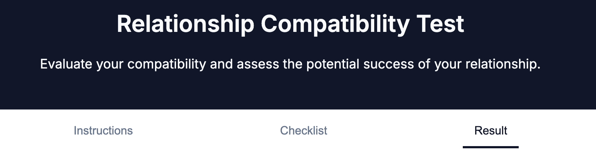
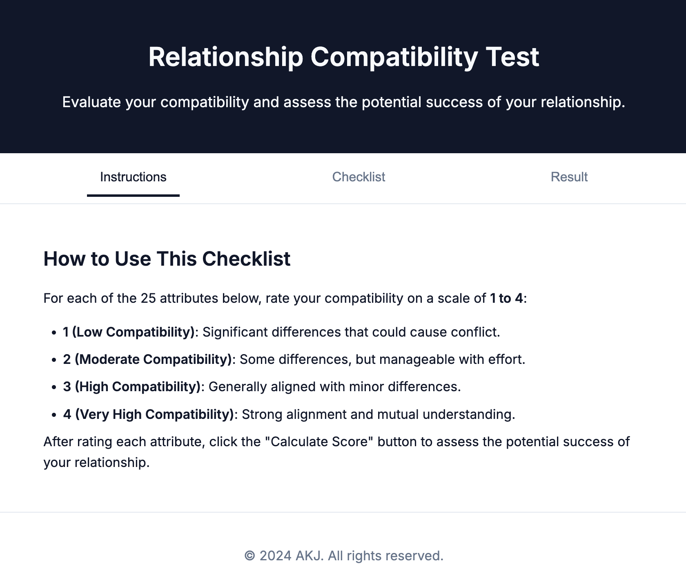
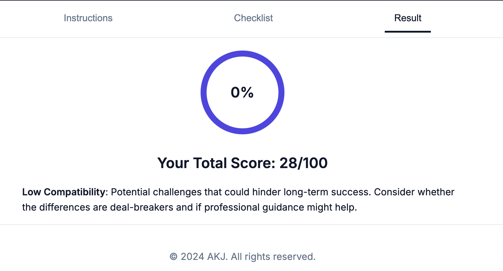

# Relationship Compatibility Test

Welcome to the **Relationship Compatibility Test**, a comprehensive web application designed to help you evaluate the potential success of your relationship. By assessing 25 key attributes, this tool provides insights into the strengths and areas for improvement in your partnership.



## 🌟 Features

- **Comprehensive Assessment**: Evaluate your relationship across **25 essential attributes**, covering emotional compatibility, shared interests, future goals, and more.
- **Interactive Scoring System**: Rate each attribute on a scale from **1 to 4**, reflecting levels from low to very high compatibility.
- **Dynamic Progress Indicator**: Keep track of your progress with real-time updates as you complete the assessment.
- **Visual Results Representation**: View your total compatibility score with an engaging **circular progress bar**.
- **Personalized Insights**: Receive tailored interpretations based on your total score to understand your relationship better.
- **Responsive Design**: Enjoy a seamless experience on any device with a fully responsive layout.
- **Modular Architecture**: Clean and maintainable codebase with content organized into separate HTML, CSS, and JavaScript files.

## 🚀 Getting Started

### Prerequisites

- A modern web browser (Chrome, Firefox, Safari, Edge)

### Installation

1. **Clone the Repository**

   ```bash
   git clone https://github.com/abhisekjha/compatibility.git
   ```

2. **Navigate to the Project Directory**

   ```bash
   cd compatibility
   ```

3. **Launch the Application**

   - Open `index.html` in your preferred web browser.

## 🛠 Project Structure

```
/compatibility
├── css/
│   └── styles.css
├── index.html
└── README.md
```

- **index.html**: Main entry point containing the common layout.
<!-- - **instructions.html**: Contains the instructions tab content.
- **checklist.html**: Contains the checklist form with all attributes.
- **result.html**: Displays the results and interpretations. -->
- **styles.css**: Contains all the styling using CSS variables and shadcn color palette.
<!-- - **script.js**: Handles tab navigation, dynamic content loading, form validation, and result calculations. -->
- **README.md**: Project documentation.

## 📖 Usage Guide

1. **Open the Application**

   - Launch `index.html` in your web browser.

2. **Read Instructions**

   - Navigate to the **Instructions** tab to understand how to use the checklist effectively.

3. **Complete the Checklist**

   - Switch to the **Checklist** tab.
   - Rate each of the 25 attributes according to your relationship.
   - The progress indicator will update as you complete the attributes.

4. **Calculate Your Score**

   - Once all attributes are rated, click the **Calculate Score** button.
   - If any attributes are incomplete, you'll be prompted to complete them.

5. **View Your Results**

   - The application will automatically navigate to the **Result** tab.
   - Your total compatibility score out of 100 will be displayed.
   - A circular progress bar will visually represent your score.
   - Read the personalized interpretation to gain insights into your relationship.

6. **Reset if Needed**

   - Click the **Reset** button to clear all inputs and start over.
   - You'll be redirected back to the **Instructions** tab.

## 🎨 Technologies Used

- **HTML5**: Semantic structure and modularization of content.
- **CSS3**: Responsive design with modern styling techniques, including CSS variables and the shadcn color palette.
- **JavaScript (ES6)**: Dynamic content loading, event handling, form validation, and data visualization.
- **SVG Graphics**: Custom-built circular progress bar for visual representation of results.

## 🌐 Compatibility

- **Desktop Browsers**: Chrome, Firefox, Safari, Edge
- **Mobile Browsers**: Mobile versions of Chrome and Safari for responsive functionality

## 🤖 Future Enhancements

- **User Authentication**: Allow users to save progress and revisit assessments.
- **Detailed Reports**: Provide in-depth analysis and recommendations based on individual attribute scores.
- **Multilingual Support**: Expand accessibility by supporting multiple languages.
- **Dark Mode**: Implement a dark theme option for better user experience in low-light conditions.
- **Share Results**: Enable users to share their compatibility scores on social media platforms.

## 👥 Contributing

Contributions are welcome! Please follow these steps:

1. **Fork the Repository**

2. **Create a Feature Branch**

   ```bash
   git checkout -b feature/YourFeature
   ```

3. **Commit Your Changes**

   ```bash
   git commit -m "Add YourFeature"
   ```

4. **Push to the Branch**

   ```bash
   git push origin feature/YourFeature
   ```

5. **Open a Pull Request**

## 📄 License

This project is licensed under the [MIT License](LICENSE), meaning you can use, modify, and distribute it as you wish.

## 📧 Contact

For questions, suggestions, or feedback, please contact:

- **Name**: Abhisek Jha
- **Email**: [abhisekjha@gmail.com](mailto:abhisekjha2020@gmail.com)
- **GitHub**: [abhisekjha](https://github.com/abhisekjha)

---

*Empower your relationship journey with insights and understanding through the Relationship Compatibility Test. Start your assessment today and unlock the potential of your partnership!*

---

## ⭐ Acknowledgments

- Inspired by the need for better relationship understanding and personal growth.
- Thanks to the open-source community for tools and libraries that made this project possible.

---

## 📝 Changelog

### Version 1.0.0

- Initial release with all core features implemented.

---

## 📷 Screenshots

### Instructions Tab



### Checklist Tab


### Result Tab



---

## 💡 Tips

- For the best experience, ensure that JavaScript is enabled in your browser.
- Use the latest version of your browser for optimal performance.

---

## 🔗 Links

- **Live Demo**: [View Project](https://abhisekjha.github.io/compatibility/)
- **Repository**: [GitHub](https://github.com/abhisekjha/compatibility)

---

*Note: This project is for informational purposes and should not replace professional relationship advice.*